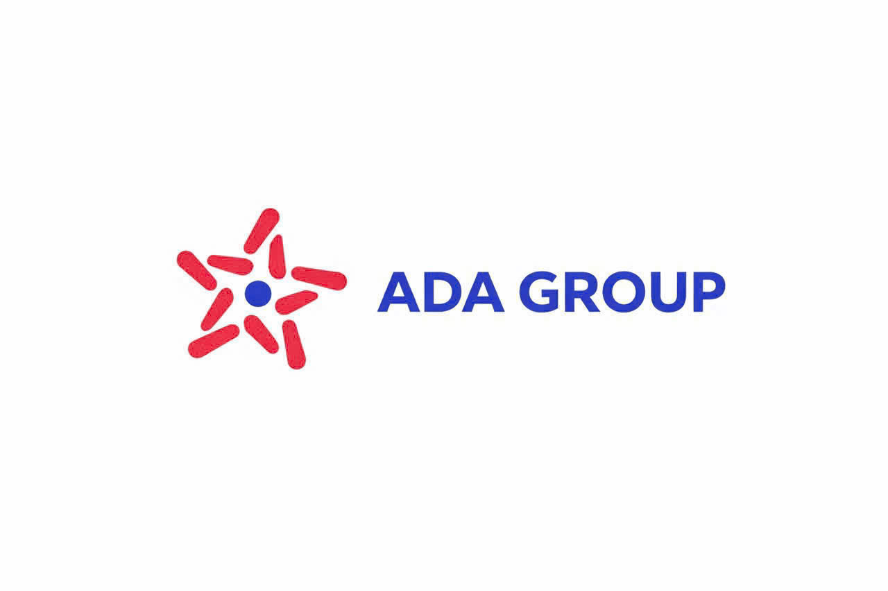

# Autolang

> An orchestration language designed from the ground up for AI to write correctly the first time — with strict host-governed capabilities.

[](https://opensource.org/licenses/MIT)
[](https://autolang.vercel.app/docs)

---

## Contents

- [Why Autolang?](#why-autolang)
- [How it works](#how-it-works)
- [Quickstart](#quickstart)
- [Real-world Workflow](#real-world-workflow)
- [Why not tool calling?](#why-not-tool-calling)
- [When to use (and when not to)](#when-to-use)
- [Security & Resource Governance](#security--resource-governance)
- [Performance](#performance)
- [Documentation](#documentation)
- [Roadmap](#roadmap)
- [Sponsors](#sponsors)
- [License](#license)

---

## Why Autolang?

Modern LLMs generate code effectively, but executing generated code safely in production remains a major engineering bottleneck.

Prompting AI to write dynamic languages like Python or JavaScript introduces runtime ambiguities, unrestricted imports, and unpredictable memory overhead. Conversely, forcing models into unfamiliar domain-specific languages causes syntax failures and hallucinated keywords.

Autolang is an orchestration language designed from the ground up for AI to write valid code on the first attempt (maximizing Pass@1), while executing strictly within host-governed capability boundaries.

Instead of sandboxing an entire operating system, Autolang enforces boundaries at the language runtime layer. It replaces the general-purpose runtime that would otherwise execute inside host isolation layers, built on two core pillars:

- **Surface Match with Kotlin:** Autolang adopts proven syntax conventions from Kotlin (`val`, `var`, `if/else`, `when`, `?.`, `arrayOf()`). Pre-trained models already possess extensive neural pathways for Kotlin, allowing them to generate syntactically valid code on the first attempt without specialized prompting.
- **Intentional Scope:** Autolang deliberately omits complex architectural constructs such as interfaces, sealed classes, reflection, and coroutines. Architectural code is for human engineering teams maintaining large systems over years, not for short-lived AI orchestration scripts. By keeping the language surface intentionally minimal, Autolang eliminates failure modes, prevents over-engineering, and ensures the model focuses strictly on capability orchestration.

---

## How it works

Autolang enforces a three-layer defense pipeline between untrusted code and the host application:

```text
AI-generated script
        │
        ▼
  ┌─────────────────┐
  │  Autolang       │  LAYER 1: Syntax normalization + static type checking
  │  Compiler       │  (absorbs syntax drift, catches type and symbol errors)
  └─────────────────┘
        │
        ▼
  ┌─────────────────┐
  │  Bytecode       │
  └─────────────────┘
        │
        ▼
  ┌─────────────────┐
  │  Autolang VM    │  LAYER 3: Opcode budget + managed memory quota
  └─────────────────┘
        │
        ▼
  ┌─────────────────┐
  │  Host           │  LAYER 2: Capability allowlist (default deny)
  │  Capabilities   │  (AI can only invoke explicitly registered functions)
  └─────────────────┘
```

1. **Compiler Layer:** Static type checking and compile-time syntax normalization catch errors prior to execution.
2. **Capability Layer:** Strict default-deny policy. Scripts cannot access system resources, network sockets, or unregistered functions.
3. **VM Layer:** Strict deterministic execution bounded by instruction limits and managed memory quotas.

---

## Quickstart

### Installation

Via npm:

```bash
npm install autolang-compiler
```

Via native C++ build:

```bash
clang++ tests/main.cpp -O2 -std=c++17
```

### Basic Usage

Register a capability in the host application and execute a script:

```javascript
import { ACompiler } from "autolang-compiler";

const compiler = new ACompiler();

// Expose a host capability
compiler.registerBuiltInLibrary("system/notification", `
    @native("notify")
    fun notify(recipient: String, message: String): Bool
`, {}, {
    notify(recipient, message) {
        console.log(`Sending notice to ${recipient}: ${message}`);
        return true;
    }
});

// Execute untrusted orchestration logic
await compiler.compileAndRun("workflow.atl", `
    @import("system/notification")

    val success = notify("Operations", "Batch task completed")
    println(success)
`);
```

The script cannot call unexposed host APIs or access runtime environments outside registered capabilities.

---

## Real-world Workflow

AI orchestrates business capabilities rather than interacting directly with infrastructure or data storage.

Expose a host service capability:

```javascript
compiler.registerBuiltInLibrary(
    "services/inventory",
    `
        class Product(
            inStock: Bool,
            price: Int
        )

        @js_object
        class InventoryService {
            @native("get_products")
            fun getProducts(): Array<Product>
        }
    `,
    { autoImport: true },
    {
        get_products() {
            return backendInventoryService.listCurrentItems();
        }
    }
);

await compiler.compileAndRun("classify.atl", `
    var premiumCount = 0
    var standardCount = 0

    InventoryService.getProducts()
        .filter {|item| item.inStock}
        .forEach {|item|
            when (item.price) {
                > 100 -> premiumCount += 1
                else  -> standardCount += 1
            }
        }

    println("Premium items: " + premiumCount)
    println("Standard items: " + standardCount)
`);
```

The generated script operates strictly through `InventoryService.getProducts()`. It has no access to underlying databases, connection pools, or adjacent system services.

---

## Why not tool calling?

Tool calling functions well for single, isolated operations. When an agent must evaluate hundreds of items, segment records, or run multi-step computations, tool calling incurs significant overhead.

```text
Tool calling                    Autolang
-----------                     --------
LLM -> call tool                LLM -> generate orchestration script
     -> wait                         -> compile
     -> reason                       -> execute inside VM against capabilities
     -> call tool
     -> wait                    Done. Deterministic local execution.
     -> reason
```

With tool calling, every step requires an API round-trip, model inference time, and accumulated context tokens. 

With Autolang, the model writes the orchestration logic once. Execution completes deterministically inside the local VM against host capabilities.

Autolang is optimal when:

- Processing batches of items through repetitive business rules
- Network latency and token consumption per round-trip are prohibitive
- Operations require deterministic conditional logic rather than repeated LLM deliberation

---

## When to use

### Use Autolang when:

- Applications execute AI-generated logic and require strict security boundaries.
- Backend services already exist in TypeScript, Go, or Python.
- Execution requires low startup latency (~10ms cold start) and minimal memory footprints.
- Bounded execution (instruction and memory budgets) is necessary to prevent runaway compute.

### Do NOT use Autolang when:

- You need a general-purpose programming language (use TypeScript or Python).
- Scripts require direct, unrestricted operating system access.
- Codebases require deep inheritance trees and complex architectural hierarchies.
- Applications do not execute untrusted AI-generated code.

Autolang standard library is intentionally minimal. Orchestration scripts focus on coordinating host capabilities rather than pulling external third-party dependencies.

---

## Security & Resource Governance

Autolang operates under a default-deny architecture. All generated code is treated as untrusted.

- **Capability Allowlist:** Access is restricted to explicitly registered `@native` and `@js_object` declarations.
- **Instruction Budget:** The VM terminates scripts that exceed a pre-configured opcode threshold, preventing infinite loops.
- **Managed Memory Quotas:** Reference counting and hot-restart arenas clear allocations immediately upon completion. Host-owned objects remain outside VM memory accounting.
- **Language Restrictions:** No raw pointers, reflection, or dynamic code evaluation (`eval`).

### Defense-in-Depth

Autolang provides language-level isolation that complements, rather than replaces, containerization (Docker, KVM, Firecracker):

- **Autolang Layer:** Restricts capability boundaries, enforces type safety, and constrains instruction/memory consumption.
- **Container Layer:** Enforces hardware isolation, filesystem virtualization, and network namespace boundaries.

---

## Performance

Measured on Windows 11 (Intel Core i5 12th Gen, 16GB RAM):

| Metric | Result |
|---|---|
| Native cold start | ~10 ms |
| Node.js cold start | ~20 ms |
| Warm execution | ~1-2 ms |
| Core runtime memory | ~0.5 MB |
| Peak memory (1,800-line test) | ~3.8 MB |

---

## Documentation

Full documentation, API guides, and language specifications are available at [autolang.vercel.app/docs](https://autolang.vercel.app/docs):

- [Getting Started](https://autolang.vercel.app/docs/introduction)
- [Architecture & Virtual Machine](https://autolang.vercel.app/docs/architecture)
- [Security Model](https://autolang.vercel.app/docs/security-model)
- [Host Integration Guide](https://autolang.vercel.app/docs/integration-npm)
- [Language Reference & Syntax](https://autolang.vercel.app/docs/language-guide/syntax)
- [Prompting & AI Reference](https://autolang.vercel.app/docs/ai-reference)
- [Frequently Asked Questions (FAQ)](https://autolang.vercel.app/docs/faq)
- [Interactive Playground](https://autolang.vercel.app/docs/editor)

---

## Roadmap

- **Auto-Schema Export:** Generate standardized capability schemas directly from host declarations for LLM context prompts.
- **Lazy Load Generics:** Support flexible collection initialization while preserving static type validation.
- **Compile-Time Syntax Normalization:** Expanded compiler absorption for common cross-language syntax variations.
- **Structured Compiler Diagnostics:** Actionable error feedback formatted for autonomous agent self-correction.
- **Core Utility Modules:** Standardized data manipulation and string formatting helpers.

---

## Contributing

Contributions are welcome. Please open an issue or submit a pull request on GitHub. Ensure proposals align with the project design principles outlined in the documentation.

---

## Sponsors

Autolang is sponsored by:

<p align="left">
  <a href="https://adagroup.com.vn/" target="_blank" rel="noopener noreferrer">
    
  </a>
</p>

Special thanks to **[ADA GROUP](https://adagroup.com.vn/)** for supporting project development.

---

## License

MIT License (c) 2026 Autolang Project