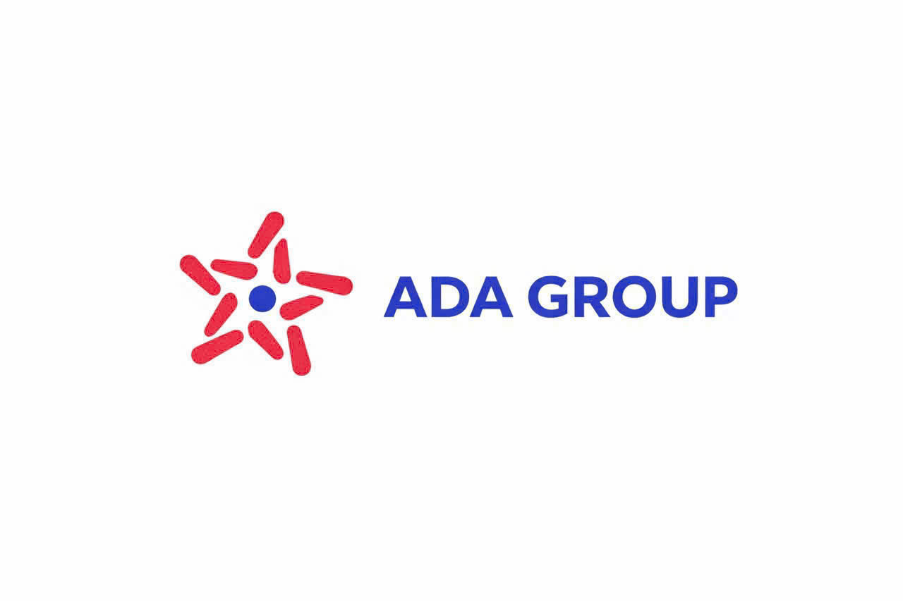

# Autolang

A statically typed, embeddable scripting language and VM engineered for validating and executing AI-generated workflows against explicitly granted host capabilities.

[](https://opensource.org/licenses/MIT)
[-orange)](https://github.com/hoansdz/Autolang)
[](https://autolang.vercel.app/docs)
[](https://www.npmjs.com/package/autolang-compiler)

[Documentation](https://autolang.vercel.app/docs) · [Getting Started](https://autolang.vercel.app/docs/introduction) · [Interactive Playground](https://autolang.vercel.app/docs/editor) · [Chatbot Demo](https://autolang-chatbot-demo.vercel.app/)

---

## Why Autolang?

In a real workflow, software agents don't just format text—they charge credit cards, update databases, and send emails. When generated code runs against a dynamic runtime, mistakes fail **late**:

### JavaScript / Python — Fail Late
1. `crm.getCustomers("enterprise")` runs.
2. `payment.charge(invoice)` runs. **The money has moved.**
3. `reporting.calculateMetrcs(...)` — misspelled. **The runtime throws a runtime error.**

**Result:** Two capabilities already ran and cannot be rolled back from inside the script. The money has left, the order was never recorded, and external state is left corrupted.

### Autolang — Fail Early (Compile First, Execute Second)
1. The compiler checks types, symbols, and permissions across the entire script in **< 1 ms**.
2. `calculateMetrcs` is misspelled. Compilation fails immediately.
3. **No capability was invoked. Zero money moved. Zero rows written.**
4. The structured compiler diagnostic returns `Did you mean: 'calculateMetrics'?`, allowing the model to self-correct on the next turn without replaying a broken business process.

> **The Goal**: Not so AI writes better code, but so a script that is written wrong **never touches the business system at all**.

---

## 30-Second Demo: Compile-Time Diagnostics

The host registers typed capabilities under a strict default-deny policy:

```typescript
compiler.registerBuiltInLibrary("analytics", `
    @native("calculateMetrics")
    fun calculateMetrics(period: String): Int
`, { autoImport: true }, {
    calculateMetrics: (period) => 42
});
```

When an LLM produces a script with a typo (`calculateMetrcs`):

```kotlin
@import("analytics")
val result = calculateMetrcs("quarterly")
```

**Real Autolang Compiler Output:**

```text
workflow.atl:2: Cannot find function name 'calculateMetrcs'
Did you mean: 'calculateMetrics'?
Hint: Verify the function name is spelled correctly and declared or imported in current scope.
```

- **Execution**: Blocked before launch (`compileAndRun` returns `false`).
- **Side effects**: **Zero.**
- **Self-healing**: The model receives the exact signature and fuzzy match to repair the call automatically.

---

## How Autolang Compares

| Solution | Compile-Time Check | Check Latency | Default-Deny Sandbox | Opcode & Memory Quotas | Syntax |
|---|---|---|---|---|---|
| **Autolang** | **Full AST & Types** | **< 1 ms (In-process)** | **Built-in** | **Built-in** | **Kotlin-like (closures, pipelines)** |
| **TypeScript (Go `tsc` + Isolate)** | Full Types | 30 ms – 150 ms | Requires custom hardening | Requires V8 isolate hooks | JS / TS |
| **Embedded Python / Lua / QuickJS** | No (Runtime only) | 1 ms – 5 ms | Requires manual stripping | Varies | Python / Lua / JS |
| **Starlark / CEL** | Partial | < 5 ms | Built-in | Limited | Restrictive (no closures/pipelines) |
| **Multi-Turn Tool Calling** | No (Fails mid-run) | Hundreds of ms / turn | Prompt-governed | Token limit only | JSON tool calls |

- **Why not TypeScript + V8 Isolate?** Even with the Go rewrite of `tsc`, type-checking and execution remain decoupled across two heavy systems. Hardening JavaScript against prototype pollution (`Object.prototype`) is fragile. Autolang compiles and executes inside a single in-process C++ engine.
- **Why not Lua / QuickJS?** Dynamically typed engines cannot catch missing functions or invalid argument types before line 1 executes external mutations.
- **Why not Starlark?** Starlark is designed for build configs (Bazel) and lacks modern workflow ergonomics like closures, collection pipelines (`filter`/`map`), and static null safety.

---

## Is Autolang Right for You?

### Use it when:
- You want an invalid AI-generated script to fail immediately before calling capabilities, not halfway through after charging a card or mutating a database.
- You need to connect AI to backend services without exposing raw credentials, sockets, or operating system shells.
- You need to execute multi-step workflows (loops, conditionals, transformations) in a single deterministic turn without 10 network round-trips.
- You want cross-language syntax tolerance so minor LLM habits (`.push()` vs `.add()`, `List` vs `Array`) don't break execution.

### Skip it when:
- You need kernel-level or hypervisor isolation for untrusted native binaries (use Docker, Firecracker, or gVisor).
- You are building large, long-running applications that depend on vast third-party package ecosystems (npm/pip).

---

## Where Autolang Sits Relative to Docker

Autolang provides **language-level capability control**, not operating-system isolation. It does not replace Docker or microVMs—it replaces the general-purpose runtime (Node.js/Python) that would otherwise execute *inside* them.

- **Docker / microVM**: Protects the OS boundary (which files, ports, and devices the process can touch).
- **Autolang VM**: Protects the business boundary (which internal capabilities the AI script can call, and how many instructions it may consume).

---

## Three Layers of Defense

1. **Pre-Execution Validation**: Full AST analysis, static type-checking, and capability signature matching in < 1 ms.
2. **Explicit Capability Sandbox**: Strict default-deny architecture. Scripts have zero ambient access to the filesystem, network, or OS unless explicitly granted.
3. **Resource Governance**: Per-script opcode budgets (`maxOpcodeCount`), managed memory limits (`maxMemoryBytes`), and execution timeouts (`executionTimeoutMs`).

---

## LLM-Tolerant Syntax

Autolang incorporates deliberate compiler tolerances so minor generation habits don't break workflows:

- **Type Absorption**: Zero-cost typealiases transparently accept cross-language habits (`List<T>`, `ArrayList<T>`, `Vector<T>` → `Array<T>`; `HashMap<K, V>`, `dict` → `Map<K, V>`; `int`, `string`, `bool`, `Double`).
- **Method Aliasing**: Hallucinated `.push()` or `.append()` calls on arrays automatically normalize to `.add()` with a compiler warning.
- **EOF Recovery**: If an LLM response gets truncated by token limits, `autoCloseBracketsOnEof` balances unclosed braces to salvage valid blocks.
- **Import Normalization**: Automatically handles `import crm.*` by resolving via internal `@import("crm")`.

---

## Quickstart

### Installation

```bash
# npm (TypeScript / Node.js)
npm install autolang-compiler

# Python
pip install autolang
```

### TypeScript / Node.js

```typescript
import { ACompiler } from "autolang-compiler";

const compiler = await ACompiler.create({
    limits: { maxOpcodeCount: 500000, maxMemoryBytes: 16 * 1024 * 1024, executionTimeoutMs: 3000 }
});

// Register host capabilities
compiler.registerBuiltInLibrary("crm", `
    @native("findCustomer")
    fun findCustomer(id: String): String
`, { autoImport: true }, {
    findCustomer: (id) => JSON.stringify({ id, name: "Alice", tier: "enterprise" })
});

// Compile and run
const ok = await compiler.compileAndRun("workflow.atl", `
    @import("crm")
    val customer = findCustomer("cust_102")
    println(customer)
`);

console.log(compiler.getOutput());
```

### Python

```python
import autolang

compiler = autolang.ACompiler({
    "limits": {"maxOpcodeCount": 500000, "maxMemoryBytes": 16 * 1024 * 1024, "executionTimeoutMs": 3000}
})

compiler.registerBuiltInLibrary("crm", """
    @native("findCustomer")
    fun findCustomer(id: String): String
""", {"autoImport": True}, {
    "findCustomer": lambda cid: f'{{"id": "{cid}", "status": "active"}}'
})

ok = compiler.compileAndRun("workflow.atl", """
    @import("crm")
    val customer = findCustomer("cust_102")
    println(customer)
""")

print(compiler.getOutput())
```

---

## Language at a Glance

```kotlin
// Null safety & Elvis operator
var name: String? = null
val greeting = "Hello, " + (name ?? "Guest")

// Pattern matching
val status = when (code) {
    200 -> "Success"
    404 -> "Not Found"
    else -> "Unknown"
}

// Collections & functional pipelines
val numbers = arrayOf(1, 2, 3, 4, 5, 6)
val evenSquares = numbers.filter { n -> n % 2 == 0 }.map { n -> n * n }

// Defensive preconditions & error handling
require(numbers.size() > 0, "Collection must not be empty")
try {
    processData()
} catch (e) {
    println("Caught: " + e)
} finally {
    cleanup()
}
```

---

## The Limit of This Guarantee

The compiler catches names, types, and capability signatures before execution. **It cannot verify whether the business rule itself is correct.** A script that charges the wrong amount or applies an unintended discount will compile cleanly and run cleanly. 

Autolang guarantees the **blast radius** of a mistake: execution stays strictly inside the granted capabilities and resource limits. It cannot guarantee human intent.

---

## Benchmarks & Evaluation

Evaluated across 4 frontier LLMs (**Claude 3.5 Sonnet, GPT-4o, DeepSeek V3, Qwen 2.5**) over **350 workflow generations per environment**:

- **0 Unhandled Runtime Crashes**: In synthetic capability benchmarks, 100% of missing function and type mismatch errors were caught before execution.
- **First-Pass Generation Success**: On par with Python and JavaScript for equivalent orchestration tasks.
- *(Note: Closed-loop capability evaluation. Workflows calling live third-party APIs remain subject to operational service errors).*

Run local benchmarks:

```bash
./build/autolang --benchmark tests/correctness/main.atl
```

---

## Standard Library

| Module | Features |
|---|---|
| `Array<T>` | `filter`, `map`, `forEach`, `sort`, `find`, `reduce`, `slice` |
| `Set<T>` | Unique-element collection with fast membership testing |
| `Map<K, V>` | Key-value dictionary with iteration and lookup support |
| `String` | Substring, split, replace, trim, casing, and template interpolation |
| `StringBuilder` | Dynamic string construction (`append`, `appendLine`, `appendRange`) |
| Builders & Checks | `buildList`, `buildMap`, `buildSet`, `require`, `check`, `requireNotNull` |
| `Math`, `Json`, `Regex` | Arithmetic (`clamp`, `round`), JSON serialization, regex matching |
| `Date` / `Time` | ISO formatting, timestamp arithmetic, duration calculation |

---

## Status & Documentation

- **Status**: `Beta (v0.8.x)`. Core C++ engine is mature (102/102 test suites passing with Kotlin stdlib parity). Host bindings are actively stabilizing toward v1.0.
- **Full Documentation**:
  - [Philosophy & Core Principles](https://autolang.vercel.app/docs)
  - [Getting Started & Setup](https://autolang.vercel.app/docs/introduction)
  - [Security Architecture & Threat Model](https://autolang.vercel.app/docs/security-model)
  - [Detailed Benchmarks](https://autolang.vercel.app/docs/benchmarks)
  - [FAQ](https://autolang.vercel.app/docs/faq)

---

## Sponsors

<p align="left">
  <a href="https://adagroup.com.vn/" target="_blank" rel="noopener noreferrer">
    
  </a>
</p>

Special thanks to **[ADA GROUP](https://adagroup.com.vn/)** for supporting project development.

---

## License

MIT License (c) 2026 Autolang Project